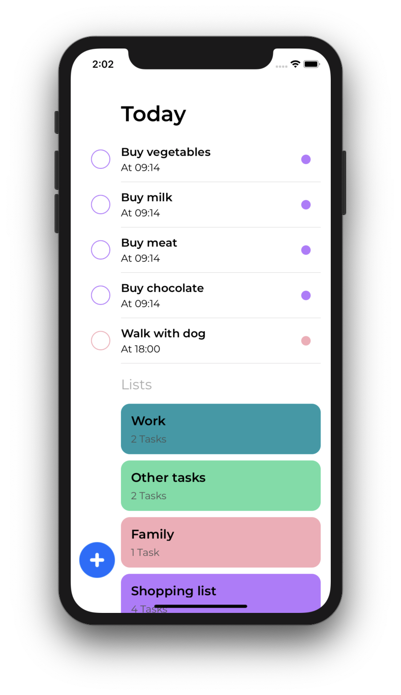
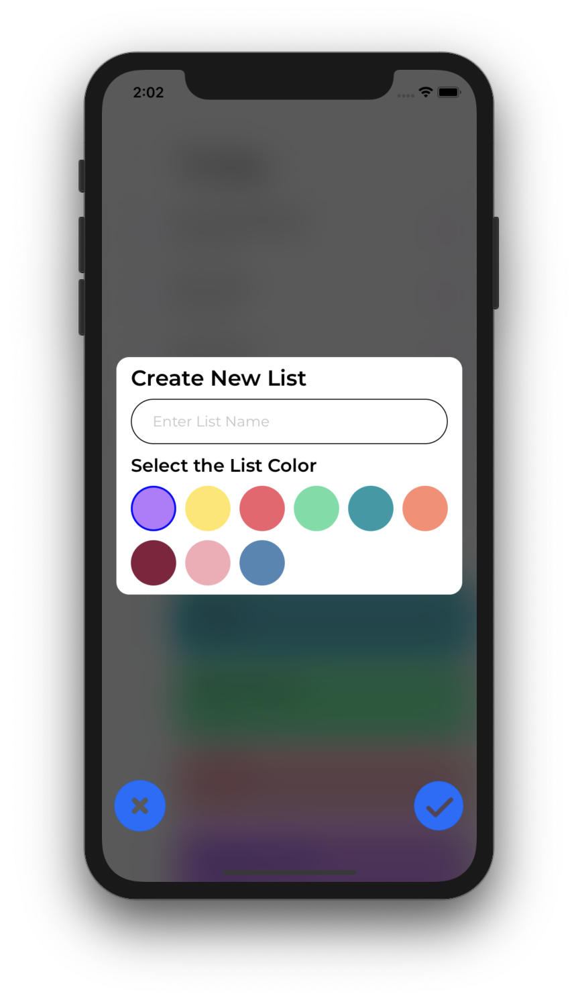
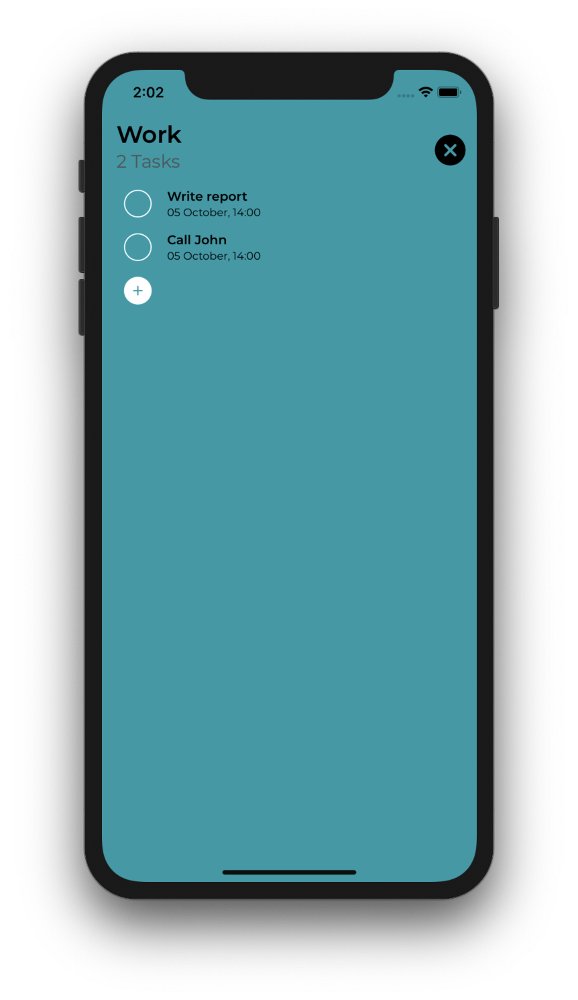
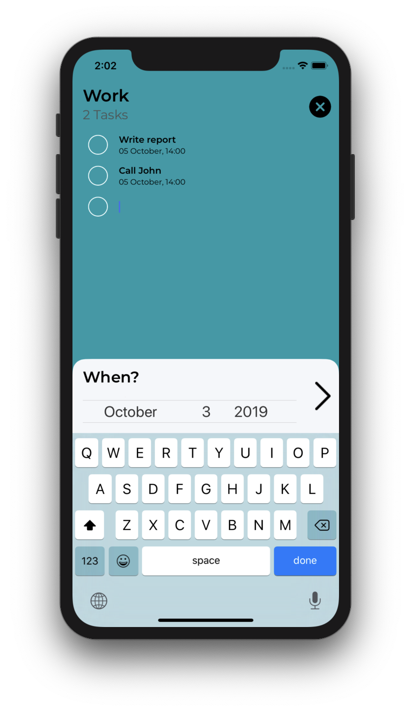
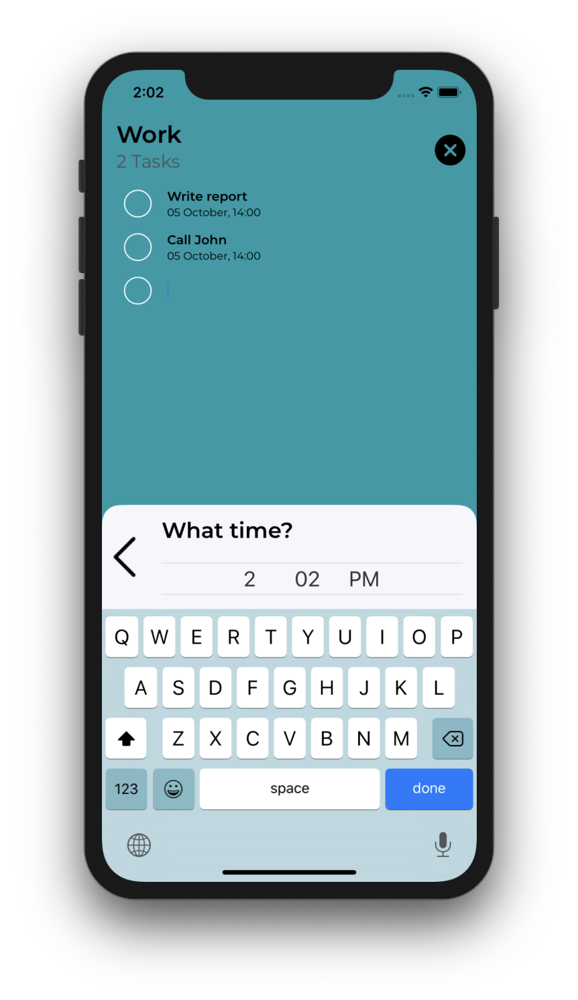

# ToDoIt
The application is simple todo application. 
Today's tasks are displayed at the top of the home screen.
The planned tasks can be grouped by themes. 
You allowed to create any list with any colour which open by touching. 

### Techonologies 
 - MVC Architecture
 - CoreData by Apple for database
 - UI is written using AutoLayout without storyboards
 
### Screenshots
 

